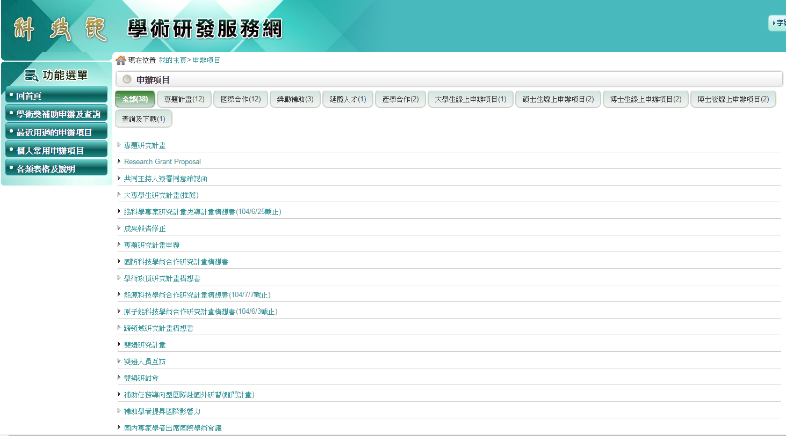
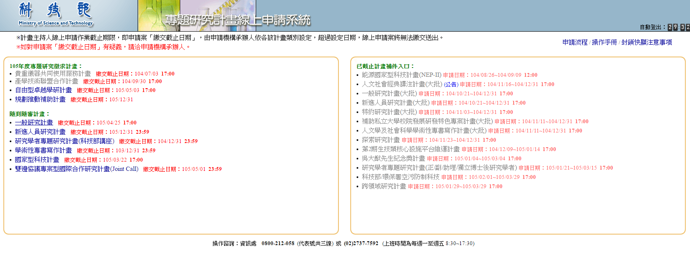
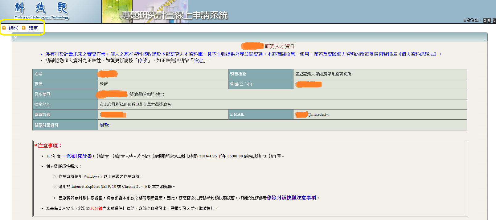
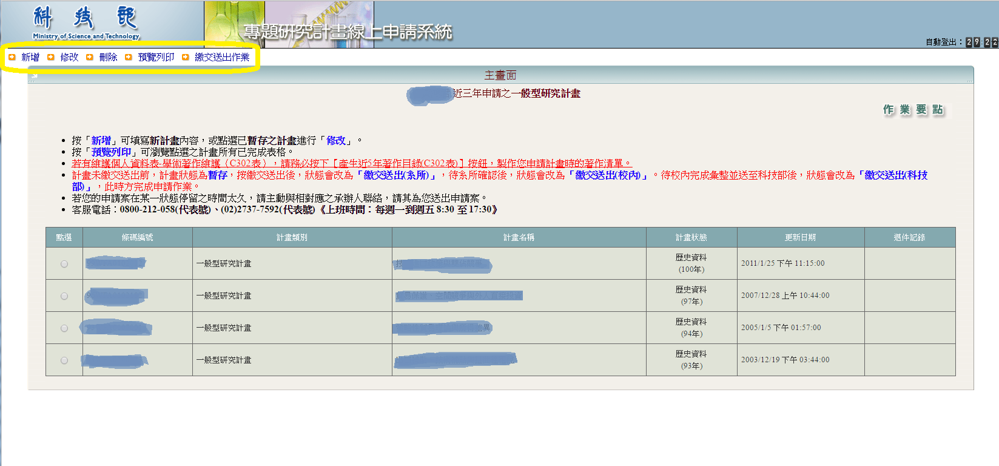
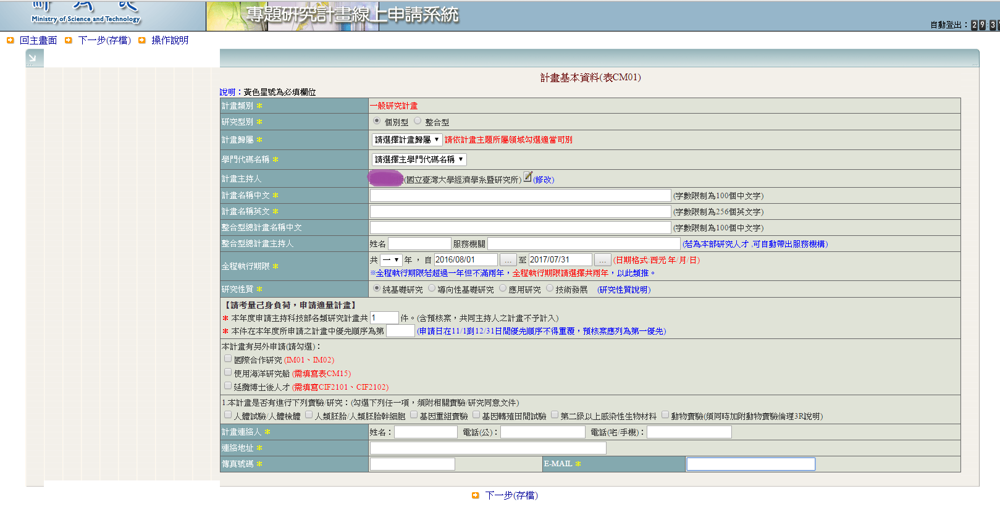
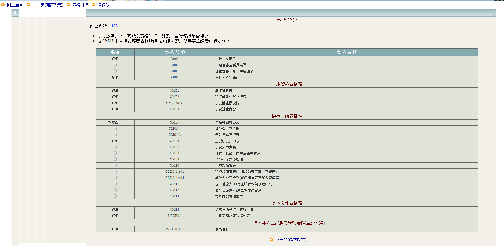
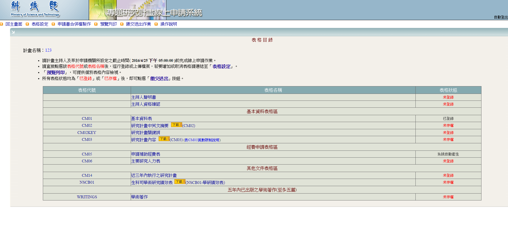

# 計畫申請

科技部計畫之申請通常老師會自行完成，但老師若無暇處理申請細節，助理需瞭解申請計畫所需資料以及申請方式。

請使用老師的帳號與密碼登入科技部網站：http://web1.most.gov.tw/。

依據老師告知的計畫類型或名稱，在網站上尋找欲申請的項目。

在此以最常申辦的專題研究計畫為例，點選[專題研究計畫]進入以下畫面：

點選[一般研究計畫]進入以下畫面。
確認個人資料是否正確，如需修改請按左上角[修改]，即可進入修改頁面；如資料正確則可直接點選[確定]。

確定後進入下方頁面。
點選左上角[新增]可建立新計畫；如欲修改尚未完成的申請，可直接點選狀態為暫存的計畫開始修改。

按照步驟直接線上填寫
1. 計畫基本資料表
   
2. 表格設定

3. 按照所選取的表格線上登錄相關資料或將檔案上傳以完成表格

4. 申請合併檔製作
   此功能可製作整份申請書之PDF合併檔，可留存供日後申請時作參考，當然也可以選擇不要製作。
   
5. 預覽列印
   請在繳交計畫前預覽表格內容，確保資料正確無誤。在繳交送出之前，所有內容都可以重複修改。
   
6. 繳交送出
   
7. 

