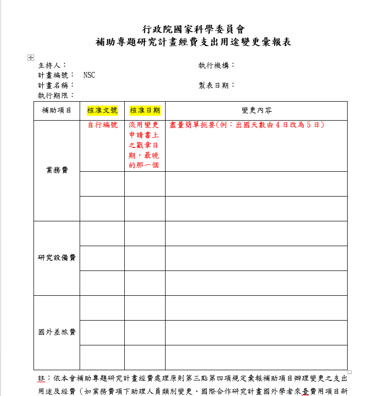

# 計畫結案

計畫快到期時，通常會計會打來請老師提供相關資料或者直接告知計劃經費之後的去向等等，但有時候也需要主動詢問會計是否該準備結案並需要提供哪些資料。

不論是幾年期的計畫，結案時都需要檢察下列項目：

- 心得、期(中)末報告
- 流用變更
- 登錄報銷

###心得、期(中)末報告
請提醒老師上傳。如果計畫有申請出席國際會議或移地調查等，皆需於回國後，登入科技部網頁上傳心得**科技部補助專題研究計畫執行國際合作與移地研究心得報告**。此外，需依照各計畫規定繳交期(中)末報告。不同計畫報告之撰寫格式不同，請登入科技部網站查詢。

###流用變更
如 [1.6 流用變更](https://sunglinhsieh.gitbooks.io/ntueconrahandbook/content/reimburse/change.html) 所示，請保留每一次的變更申請書，在結案時需將1)所有變更申請書及2)依照變更申請書填寫的**行政院國家科學委員會補助專題研究計畫經費支出用途變更彙報表**一併交給負責的會計(社科院負責一般科技部計畫的會計為**賴秋萍**)。

彙報表的核准文號請自行編號。核准日期，通常填寫流用變更申請書上眾多戳章之中最晚的日期。
如下：

###登錄報銷
會計審核完該計畫所有帳之後，會告知該計畫帳目的**支付憑證起訖號**與**報銷金額**，請登入科技部網站，點選該計畫之**經費報銷**按鈕，於報銷作業頁面填寫各補助項目之支付憑證起訖號與報銷金額。

存檔後
即可於該頁點選**收支名細報告表**並列印(列印份數請依各計畫規定)。

將收支明細報告表拿至研發處蓋章，並詢問是否完成。

