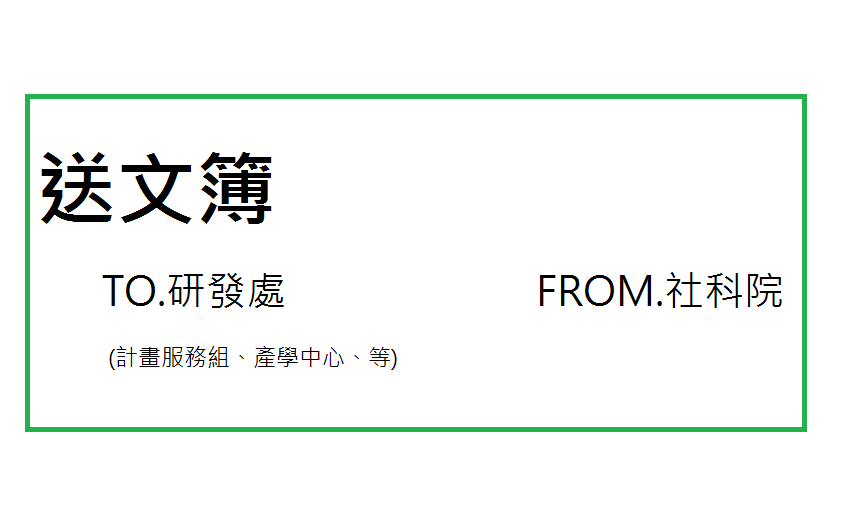

# 公文交換
## 公文交換理念簡介
公文往返的方式有二，其一為親送，其二即為公文交換。公文交換可以讓助理在不走出社科大樓的情形下，將公文送到他該去的地方，只是有送丟的風險。使用時須自行衡量便利性及弄丟風險在自己心中孰輕孰重。公文交換仍有其限制，部分單位僅能以親送方式傳送公文。

公文簿共七種，包含主計室、人事室、研發處、總務處、教務處、學務處，另有一本公文簿名為"其他單位"，除前六項所述單位外之單位，皆須填寫此本。

以下圖為例，欲傳送之單位請依照送文簿底下的 TO.XXX 進行選擇，

##交換流程

1. 至院辦公室外之公文交換區
2. 依所欲交換之單位拿取公文交換簿--交換簿可能置於送文箱內，或綠色L型盒中。
3. 填寫公文交換簿。通常送往同一受文者之公文會放在同一個公文袋中，而該公文袋中的文件只須寫在同一欄，填寫時文號欄可填多個；送往同一處室但受文者不同時(同為主計室但一份要給會計組一份要給基金組)，請分欄填寫。

 時間 | 單位 | 文號
 :---:|:---:|:---:
 8/16 | 主計室-會計組 | 105TXXXKXXX、105TXXXKOOO
 8/16 | 主計室-審核組 | 105TXXXKXXX、105TXXXKOOO、105TXXXKYYY
 8/22 | 主計室-基金組 | 105TXXXKXXX、105TXXXKOOO
 
4. 填寫完公文簿後，於公文袋的櫃子裡取出所需的多次用公文封數量，一個受文者的文件就裝在同一個公文袋中，公文袋封面也需填寫表格，不同公文袋的樣式可能不同，依其樣式填寫即可。範例如下:

 收件單位 | 收件人 | 寄件單位 | 寄件人
 :---:|:---:|:---:|:---:
主計室-會計組 | 賴秋萍小姐 | 經濟系 | 陳宜均

 日期  | 收件單位 | 寄件單位 | 備註
 :---:|:---:|:---:|:---:
5/13  |主計室-會計組 | 經濟系 |  105TXXXKXXX、105KXXXTOOO

5. 填寫完公文袋後，將公文放入、將公文袋封口，之後夾入填寫公文簿的那一頁，放入送文箱即可。

##特殊處室

1. 有關人事薪資報帳核章(ex.勞健保)，請本人親送人事室。
2. 交換時請注意查看所欲交換之單位有無特殊公告，若有，請依公告規則行之。
 