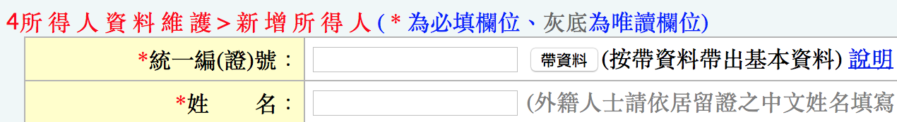
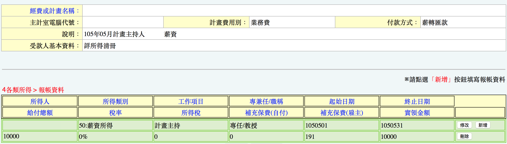

# 薪水
 助理第一次報薪水時,要先到系統的**所得報帳** → **所得人資料維護**將受薪者 (教授、助理) 加進去,通常是將身份字號輸入之後按**代資料**即可,如下圖
 
台大的薪資除了郵局以外,還可以匯到玉山銀行或華南銀行。

### 計畫人員主持費、兼任助理薪水

其實報薪水的流程都大同小異,其中以報計畫人員主持費、兼任助理薪水的流程最 為簡單。故先說明這兩種情形,其他種類的人員薪水就只說明與這兩者的差異。

報計畫人員主持費、兼任助理薪水的步驟如下首先需要一張報帳的單子,稱為**黏存單**,取得方法如下:

1. 到系統的**所得報帳** → **各類所得**
2. 輸入計畫或部門代碼
3. 填寫說明,例如: 105年05月計畫主持人 XXX 薪資 
4. 填寫相關報帳資料,以主持費為例,完成圖如下圖
5. 點選**送件至出納組**,送完之後可以回到**各類所得**,應該會看到剛剛報的帳 目此時**目前狀態**欄底下應該是**未閱**。若變成**通過**,表示會計室確認報帳資料 正確,即可到下一步驟
6. 選列**印所得表+黏存單**,以**兩份**選項為例,會印出三面的 pdf 檔,分別是兩聯所得表以及一張黏存單。
7. 黏貼方式為將第二聯所得表浮貼在黏存單的**憑證黏貼線**下方 (第二聯所得表的下半部空白處可撕掉),再一併與第一聯所得表釘起來 (第一聯所得表釘在後方),即完成報帳單。若選三份的選項,會多一張第三聯所得表,報賬單位可以自己留存。

黏存單的蓋章請參照 1.6節,蓋完助理及教授的章後要到系辦及院辦蓋章,系辦 請找負責出納的系辦人員,院辦請找負責核章的院辦人員。
  蓋完系辦院辦的章後就可以直接交給主計室會計組負責社科院報帳的人員。