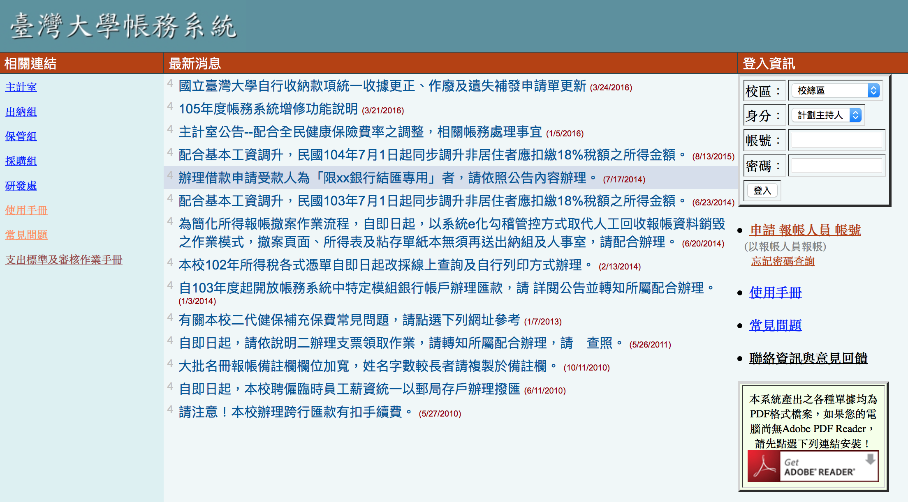
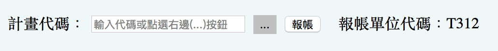

# 帳務系統
 所有報帳一律在**臺灣大學帳務系統**,登入頁面如下圖。
 
 
 
 新的助理會需要一個報帳人員的帳號,通常有兩種情況

* 前任助理有把帳號留下來:此時要到報帳系統內的**報帳管理** → **設定報帳選項**內,將報帳人的資料改成自己的。
* 前任助理沒有把帳號留下來:新任助理自己在臺灣大學帳務系統頁面申請一個新的報帳帳號。

若教授有特別需要,會開計畫助理的權限給助理,可以看到管理計畫的資訊。否則助理的帳號登入時身份為報帳人員。此外,新任助理在第一次報帳時要附上自 己簽完名的聘書影本。

報帳時,不管是報什麼東西,都會要先選計畫,如下圖。第一次報帳輸入過之後都可以按旁邊三個點的按鈕尋找輸入過的計畫代碼、名稱。
