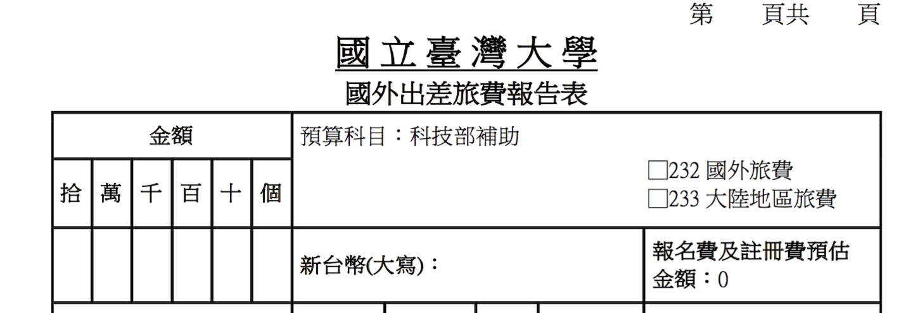

# 差旅費

##國外差旅費

報國外差旅費的起點是要先請教授到請假頁面下載**國外出差旅費報告表**，範例如下圖。

國外差旅費主要包含以下幾項:

* 機票
* 生活費
* 辦公費

以下就依照這三個項目做詳細的討論。

###機票

報機票會需要

* 登機證
* 電子機票
* 代轉支付收據

注意，計畫支應教授出國的機票沒意外會是**標準經濟艙**。若教授有自掏腰包升等的話，除了代轉支付收據要另外開以外(標準經濟艙與額外升等費用，報帳不需後者)，需要請購票單位(旅行社)開立一張**票價證明書**，以證明代轉支付上的金額為標準經濟艙的費用。

此外，若教授出國的班機非本國籍航空公司(非長榮、華航、立榮...等)需另外填寫**搭乘外國籍航空公司班機申請書**。

###生活費

報支生活費的邏輯是依照**國外各地區出差人員生活費日支數額表**上訂定的日支生活費去申報生活費。生活費的組成包含70%住宿費、20%膳食費(早餐4%、午餐8%、晚餐8%)、零用錢10%。其中零用錢包含市區火車、市區公共汽車票費、市區捷運、個人信用卡手續費、洗衣費、小費及其他與生活有關之各項費用。而在國內如果是搭計程車去機場搭飛機的話，這筆計程車費是無法報支的。

其中要注意日支生活費皆是以美金計算，將此金額轉換成台幣的匯率以教授**出國前一天****台灣銀行**的**即期賣出**匯率計算，報帳時需將整個網頁印下當附件。

為了避免出國時時區不同造成的各種不便，申報每日所在地點與行程時，皆以**台灣時區**為主(以後面的範例來說明)。

以下就用幾個範例來說明各種細節。

####範例一(簡單案例)

教授8/16-8/22到舊金山出差，搭乘長榮班機。假設機票45,000元，而起降時間如下(以下皆為當地時間)：

* 8/16 23:30 TPE → 8/16 20:20 SFO 
* 8/22 18:20 SFO → 8/23 22:10 TPE

不過由於我們需要用台灣時區計算，因此實際時間如下：

當地時間| 台灣時間 | 事項
 :---:|:---:|:---:
 8/16 23:30 | 8/16 23:30 | 離開TPE
 8/16 20:20 | 8/17 11:20 | 抵達SFO
 8/22 18:20 | 8/23 09:20 | 離開SFO
 8/23 22:10 | 8/23 22:10 | 抵達TPE
 
舊金山的日支生活費是290美元，我們假設前一工作日(8/15)美金的匯率是31.313，因此日支生活費為9,080.77元。
 不過由於啟程的8/16以及回程的8/23是在飛機上過夜，因此這兩天的生活費不包含住宿的70%，故這兩天報支 290$$\times$$31.313$$\times$$0.3=2,724.231元。而差旅費報告表範例如下：

月| 8 | 8 | 8
 :---:|:---:|:---:|:---:
 日| 16-17| 18-22 |23
 起訖地點 | 台北→舊金山 |舊金山|舊金山→台北
 工作記要 | 啟程 | 研究 | 返程
 飛機 |45,000| |
 生活費 | 9,080.77$$\times$$1.3=11,805.001|9,080.77$$\times$$5=45,403.85| 9,080.77$$\times$$0.3=2,724.231
 總計| 104,933| |

而為了給會計人員更方便確認你怎麼算出來的，可以自己在差旅費報告表裡自己加一列**備註**，以下是我在**備註**列中習慣寫的格式：

1. 8/16出國，前一工作日(8/15)之即期匯率為 31.313 台幣/美元
2. 舊金山日支生活費290(USD)$$\times$$33.313(匯率)=9080.77(NTD)。 8/16啟程報支2,723.97元，與8/17共1天報支9,080.77元。 8/16-17總  計11,805.001元
3. 8/18-22共5天共報支45,403.85元
4. 8/23回程報支9079.9$$\times$$0.3=2,724.231元
5. 8/16-23共報支59,933元
6. 報支機票 45,000 元,生活費 59,927 ,合計 104,933 元

其中要注意生活費的金額要用總額一次四捨五入，不然會產生多一塊或少一塊的情況。

####範例二 (多地點、支出分攤)

教授出差為先到舊金山，再到芝加哥，最後從芝加哥出發，經由舊金山轉機回台。詳細航班如下(同樣皆為當地時間)，假設機92,000元：

* 8/16 23:35 TPE → 8/16 20:35 SFO
* 8/22 16:40 SFO → 8/22 22:57 ORD
* 8/29 18:40 ORD → 8/29 21:25 SFO
* 8/30 01:40 SFO → 8/31 05:25 TPE

同樣我們必須先算出每個起降的台灣時間：

當地時間| 台灣時間 | 事項
 :---:|:---:|:---:
 8/16 23:35 | 8/16 23:35 | 離開TPE
 8/16 20:35 | 8/17 11:35 | 抵達SFO
 8/22 16:40 | 8/23 07:40 | 離開SFO
 8/22 22:57 | 8/23 11:57 | 抵達ORD
 8/29 18:47 | 8/30 07:57 | 離開ORD
 8/29 21:25 | 8/30 12:25 | 抵達SFO
 8/30 01:40 | 8/30 16:40 | 離開SFO
 8/31 05:25 | 8/31 05:25 | 抵達TPE
 
