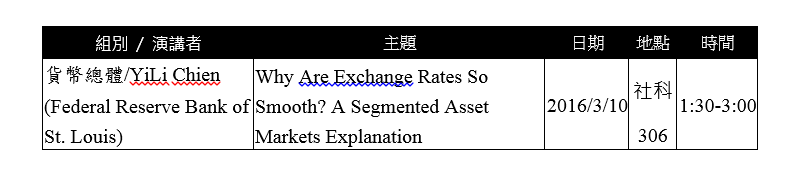

# 一般花費

所謂一般花費意旨差旅費以及設備器材費以外的費用，比較常報的費用有：

* 文具、印表機用紙
* 影印費
* 郵寄費
* 論文編修費、投稿費
* 研討會學者餐費
* 電話費(若教授在辦公室有另外申裝電話時會需要)
* 碳粉匣、隨身硬碟

##研討會學者餐費

此花費僅系辦公室之曾玉芳小姐可以報帳，因此只要交付三樣東西給她即可，分別為：發票、該次餐點項目單、以電子郵件寄送之word文件。
word文件須包含四部分：

1. 此次聚會說明
2. 研討會場次：含組別/演講者、主題、日期、地點、時間
3. 一同用餐之教授名單
4. 用餐金額

以下提供上述四點之個別範例

1. 聚會說明：本系為提升學術研究水準，邀請國外優秀專家學者前來臺灣，透過公開演講，與本系師生學術交流會談，進行學術研究討論，交換心得互相切磋，以提升雙方之研究品質，期待綜合提升本校及本系之研究水平，並推動「邁向頂尖大學計畫」，促進國際學術交流。[註]需視學者身分進行改寫。

2. 演討會場次
  
3. 一同用餐之教授名單：演講會前本系XXX老師、YiLi Chien、XXX、XXX、XXX、XXX、XXX共計7人進行學術研究討論，交換心得互相切磋，以提升研究品質，並討論本系與國外研究機構合作之學術研究交流計畫。

4. 用餐金額：本次演講會及參與學術討論之會議之餐費共計新台幣XXX元。應廠商要求支付現金，餐費總計XXX元，由XXX老師先行代墊費用。

